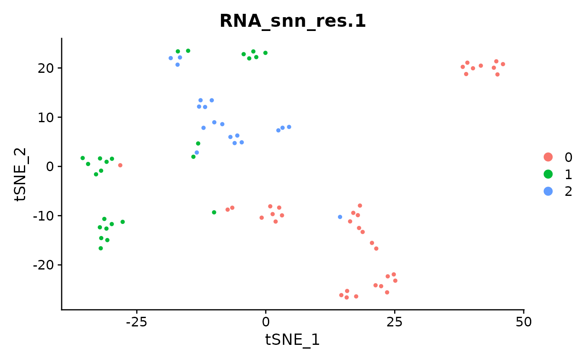
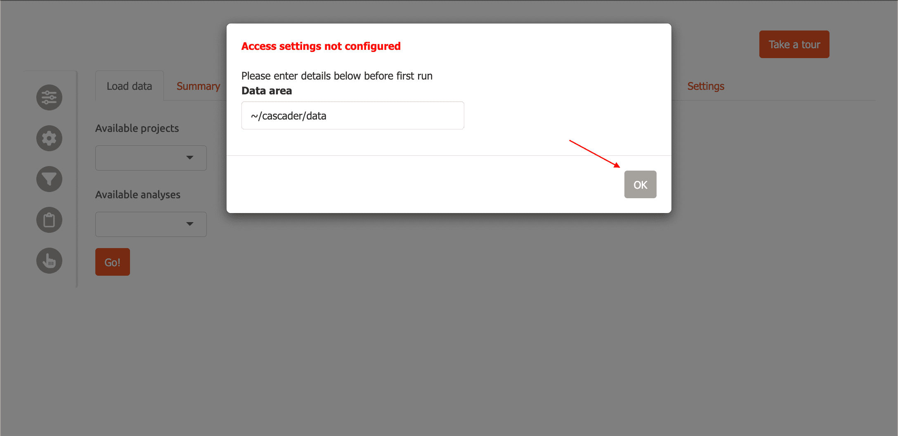

# cascadeR

Abstract

`cascadeR` is an interactive & modular Shiny app that simplifies and
transforms complex single-cell RNA-Seq and spatial transcriptomics data
using numerous interactive features. Designed for both computational and
experimental biologists, `cascadeR` supports both R and python
ecosystems, making data exploration and accessible, while also providing
a platform to manage multiple datasets either locally or on a server to
share with collaborators (package version: 0.99.0).

### Install cascadeR

Install cascadeR from Bioconductor using
[`BiocManager::install`](https://bioconductor.github.io/BiocManager/reference/install.html).

``` r

# first check to see if BiocManager is available
if(!requireNamespace('BiocManager', quietly=TRUE)){
  install.packages('BiocManager')
}

BiocManager::install('cascadeR')
```

### Get example data

Now we load a small dataset with 80 cells and 230 features. It contains
two dimension reductions: *pca* and *tsne*.

``` r

library(Seurat)
#> Loading required package: SeuratObject
#> Loading required package: sp
#> 'SeuratObject' was built under R 4.6.0 but the current version is
#> 4.6.1; it is recomended that you reinstall 'SeuratObject' as the ABI
#> for R may have changed
#> 
#> Attaching package: 'SeuratObject'
#> The following objects are masked from 'package:base':
#> 
#>     intersect, t

data("pbmc_small", package="SeuratObject")

pbmc_small
#> An object of class Seurat 
#> 230 features across 80 samples within 1 assay 
#> Active assay: RNA (230 features, 20 variable features)
#>  3 layers present: counts, data, scale.data
#>  2 dimensional reductions calculated: pca, tsne
```

### Inspect the metadata

Next, let’s take a look at the metadata of this object.

``` r

head(pbmc_small)
#>                   orig.ident nCount_RNA nFeature_RNA RNA_snn_res.0.8
#> ATGCCAGAACGACT SeuratProject         70           47               0
#> CATGGCCTGTGCAT SeuratProject         85           52               0
#> GAACCTGATGAACC SeuratProject         87           50               1
#> TGACTGGATTCTCA SeuratProject        127           56               0
#> AGTCAGACTGCACA SeuratProject        173           53               0
#> TCTGATACACGTGT SeuratProject         70           48               0
#> TGGTATCTAAACAG SeuratProject         64           36               0
#> GCAGCTCTGTTTCT SeuratProject         72           45               0
#> GATATAACACGCAT SeuratProject         52           36               0
#> AATGTTGACAGTCA SeuratProject        100           41               0
#>                letter.idents groups RNA_snn_res.1
#> ATGCCAGAACGACT             A     g2             0
#> CATGGCCTGTGCAT             A     g1             0
#> GAACCTGATGAACC             B     g2             0
#> TGACTGGATTCTCA             A     g2             0
#> AGTCAGACTGCACA             A     g2             0
#> TCTGATACACGTGT             A     g1             0
#> TGGTATCTAAACAG             A     g1             0
#> GCAGCTCTGTTTCT             A     g1             0
#> GATATAACACGCAT             A     g1             0
#> AATGTTGACAGTCA             A     g1             0
```

There are two columns with standard quality control metrics:

- *nCount_RNA*
- *nFeature_RNA*

In addition, there are two columns with cell clusters calculated at two
resolutions. Higher resolutions correspond to more/smaller cell
clusters.

- *RNA_snn_res.0.8*: resolution = 0.8, 2 clusters
- *RNA_snn_res.1*: resolution = 1, 3 clusters

We visualize the resolution = `1.0` clustering using
[`Seurat::DimPlot`](https://satijalab.org/seurat/reference/DimPlot.html):

``` r

Seurat::DimPlot(pbmc_small, group.by='RNA_snn_res.1')
```



### Marker detection

Next, we calculate gene markers to characterize individual clusters for
one of the resolutions using the
[`Seurat::FindAllMarkers`](https://satijalab.org/seurat/reference/FindAllMarkers.html)
function. Setting
[`Idents()`](https://satijalab.github.io/seurat-object/reference/Idents.html)
here to `RNA_snn_res.0.8` sets the cell groups to clusters at resolution
= `0.8`.

``` r

Idents(pbmc_small) <- pbmc_small$RNA_snn_res.0.8
df <- FindAllMarkers(pbmc_small)
#> Calculating cluster 0
#> For a (much!) faster implementation of the Wilcoxon Rank Sum Test,
#> (default method for FindMarkers) please install the presto package
#> --------------------------------------------
#> install.packages('devtools')
#> devtools::install_github('immunogenomics/presto')
#> --------------------------------------------
#> After installation of presto, Seurat will automatically use the more 
#> efficient implementation (no further action necessary).
#> This message will be shown once per session
#> Calculating cluster 1
```

Now we have marker genes for each of the clusters at this resolution.

``` r

head(df)
#>               p_val avg_log2FC pct.1 pct.2    p_val_adj cluster   gene
#> S100A8 6.102871e-14  -6.525729 0.075 0.926 1.403660e-11       0 S100A8
#> TYMP   4.087494e-13  -3.512621 0.151 0.963 9.401236e-11       0   TYMP
#> S100A9 1.093387e-11  -5.546585 0.151 0.852 2.514790e-09       0 S100A9
#> LYZ    7.726663e-11  -3.033164 0.453 1.000 1.777132e-08       0    LYZ
#> IFITM3 1.120932e-10  -3.285522 0.075 0.815 2.578143e-08       0 IFITM3
#> CST3   2.732858e-10  -2.469198 0.321 0.963 6.285574e-08       0   CST3
```

We often like to compare different resolutions, so let’s do the same for
resolution = `1.0`.

``` r

Idents(pbmc_small) <- pbmc_small$RNA_snn_res.1
df2 <- FindAllMarkers(pbmc_small)
#> Calculating cluster 0
#> Calculating cluster 1
#> Calculating cluster 2
```

You can combine multiple such marker gene tables for use with `cascadeR`
to compare, e.g. different resolutions, “assays” or arbitrary “groups”.
To do this, we concatenate our two marker gene sets and add a
“resolution” column.

``` r

df$resolution <- '0.8'
df2$resolution <- '1.0'

marker_df <- rbind(df, df2)
```

### Save results

Next, we save our results.

``` r

saveRDS(pbmc_small, 'seurat_pbmc_small.Rds', compress=FALSE)
write.table(marker_df, 'allmarkers_combined.tsv', sep='\t', row.names=FALSE, quote=FALSE)
```

### Data Organization

Next, we need to organize your data in a directory structure that
`cascadeR` can easily navigate, e.g. in a folder `cascader/data` in your
home directory. The folder should look something like this:

    ~/cascader/data/
      └─ my-project
         └─ pbmc_small
            ├─ clustered.Rds
            └─ allmarkers.tsv

Two things to note here:

- *Projects* are subfolders in the data area, while *analyses* are
  subfolders within projects. For instance, in the above example,
  `my-project` is the project name and `pbmc_small` is the analysis
  name. This 2-level hierarchy allows us to have multiple analyses
  using, e.g different analysis parameters, within a single project.

- `cascadeR` uses file extensions, e.g. `.Rds` or `.h5ad`, to figure out
  what data to read. You can have two kinds of files in an *analysis*
  folder:

  - Pre-processed single-cell/spatial object

    - `.Rds` (Seurat or SingleCellExperiment)
    - `.h5ad` (anndata)

  - Marker tables: `.tsv` or `.csv`

    - Marker genes for a cluster (compared to everything else).

      - Output from Seurat’s `FindMarkers` or `FindAllMarkers` or
        scanpy’s `sc.tl.rank_genes_groups` are supported.
      - Filenames must contain the string *allmarkers*.

    - Conserved marker genes across samples.

      - Output from Seurat’s `FindConservedMarkers`.
      - Filenames must contain the string *consmarkers*.

    - Differential expression analysis, from comparing cell clusters or
      from pseudo-bulk analysis.

      - Output from Seurat’s `FindMarkers` or pseudo-bulk analysis from
        `DESeq2` are supported.
      - Filenames must contain the string *demarkers*.

    - Marker gene tables supports special columns, “resolution”,
      “assay”, “group” to combine multiple sets of results for joint
      viewing.

    - If multiple marker gene tables of a particular type are found in
      the same *analysis* folder, they are concatenated together with
      the file name encoded in the “group” column.

### First Run

Load the `cascadeR` package.

``` r

library(cascadeR)
```

CascadeR allows you to download interactive plots as PDF. To use this
functionality you need to install some required Python dependencies:

``` r

install_cascade()  # Installs plotly and kaleido for PDF export
```

Now, run the app:

``` r

run_cascade()
```

To run on a fixed port, e.g. when using remote servers with SSH port
forwarding, specify `port` within a list of options.

``` r

run_cascade(options=list(port=12345, launch.browser=FALSE))
```

Then access cascadeR by opening the URL: `http://127.0.0.1:12345`

### Set up cascadeR analysis

We provide a helper function to set up a dataset while following
cascadeR’s specifications. Let’s use this now for the analysis we just
performed.

First we create a data directory for `cascadeR`.

``` r

dir.create('~/cascader/data', recursive=TRUE)
```

Next, we run `add_cascade_analysis` with the RDS file and marker table
path specified. By default, this function prints out the commands to be
run - to actually run them, we use `execute = TRUE`.

``` r

add_cascade_analysis(
  obj_path='seurat_pbmc_small.Rds',
  data_dir='~/cascader/data',
  project='my-project',
  analysis='pbmc_small',
  cluster_markers='allmarkers_combined.tsv',
  execute=TRUE
)
#> 
#> - Data directory:"~/cascader/data" already exists
#> 
#> - Project directory:"~/cascader/data/my-project" does not exist. Creating it
#> 
#> mkdir -p ~/cascader/data/my-project
#> - Analysis directory "~/cascader/data/my-project/pbmc_small" does not exist, creating it
#> 
#> mkdir -p ~/cascader/data/my-project/pbmc_small
#> Setting up project:
#> ln -s /home/runner/work/cascadeR/cascadeR/vignettes/seurat_pbmc_small.Rds ~/cascader/data/my-project/pbmc_small/seurat_pbmc_small.Rds
#> ln -s /home/runner/work/cascadeR/cascadeR/vignettes/allmarkers_combined.tsv ~/cascader/data/my-project/pbmc_small/allmarkers.tsv
#> 
#> All done! Remember to add "~/cascader/data" to Cascade data areas to view new analysis
```

### Initial setup

The first time you run cascadeR, you will be asked to specify where your
data is located with a modal dialog. Enter the folder where you saved
the RDS file, `~/cascader/data`, then click ‘OK’.



Now cascadeR will automatically refresh and you will see
`data/my-project` in the “Available Projects” menu, and `pbmc_small` in
the “Available Datasets”. You can click on the table directly or choose
from the dropdown menu to select the dataset. Now click ‘Go’ to load the
data.


Now carnation will load the pbmc data and switch to the “Summary” tab.

### General layout

The interface of CascadeR consists of a main central panel for content,
a sidebar containing settings and ‘Gene scratchpad’ buttons.


### Feature overview

Now you can explore the dataset further using cell embeddings,
e.g. tSNE.


Visualize marker gene expression using dotplots,


and feature plots


and investigate gene candidates using “Cell Markers” module.


CascadeR provides many more features to allow extensive exploration of
single-cell datasets.

- UMAP/spatial cell-embeddings or marker plots support lasso selection
  to select cells of interest. These selections can be used to create
  custom filters for the data or downloaded for further analysis.
- Marker tables can be directly clicked to select genes which can then
  be added to the gene scratchpad and tracked across the whole app.
- Custom filters can be created for cells based on metadata, gene
  expression or cell selection and save throughout a session.
- All plots can be saved to PDF and marker tables downloaded to TSVs.

For multi-user environments, CascadeR also supports authentication:

``` r

# Create user database
credentials <- data.frame(
  user = c('shinymanager'),
  password = c('12345'),
  admin = c(TRUE),
  stringsAsFactors = FALSE
)

# Initialize the database
shinymanager::create_db(
  credentials_data = credentials,
  sqlite_path = 'credentials.sqlite',
  passphrase = 'admin_passphrase'
)
```

`{r run_auth, eval=FALSE) # Run with authentication run_cascade(credentials='credentials.sqlite', passphrase='admin_passphrase')`

## sessionInfo

``` r

sessionInfo()
#> R version 4.6.1 (2026-06-24)
#> Platform: x86_64-pc-linux-gnu
#> Running under: Ubuntu 24.04.5 LTS
#> 
#> Matrix products: default
#> BLAS:   /usr/lib/x86_64-linux-gnu/openblas-pthread/libblas.so.3 
#> LAPACK: /usr/lib/x86_64-linux-gnu/openblas-pthread/libopenblasp-r0.3.26.so;  LAPACK version 3.12.0
#> 
#> locale:
#>  [1] LC_CTYPE=C.UTF-8       LC_NUMERIC=C           LC_TIME=C.UTF-8       
#>  [4] LC_COLLATE=C.UTF-8     LC_MONETARY=C.UTF-8    LC_MESSAGES=C.UTF-8   
#>  [7] LC_PAPER=C.UTF-8       LC_NAME=C              LC_ADDRESS=C          
#> [10] LC_TELEPHONE=C         LC_MEASUREMENT=C.UTF-8 LC_IDENTIFICATION=C   
#> 
#> time zone: UTC
#> tzcode source: system (glibc)
#> 
#> attached base packages:
#> [1] stats     graphics  grDevices utils     datasets  methods   base     
#> 
#> other attached packages:
#> [1] cascadeR_0.99.0    Seurat_5.5.1       SeuratObject_5.4.0 sp_2.2-3          
#> [5] BiocStyle_2.40.0  
#> 
#> loaded via a namespace (and not attached):
#>   [1] RcppAnnoy_0.0.23            shinythemes_1.2.0          
#>   [3] splines_4.6.1               later_1.4.8                
#>   [5] R.oo_1.27.1                 tibble_3.3.1               
#>   [7] polyclip_1.10-7             fastDummies_1.7.6          
#>   [9] shinymanager_1.1.0          lifecycle_1.0.5            
#>  [11] rprojroot_2.1.1             globals_0.19.1             
#>  [13] lattice_0.22-9              MASS_7.3-65                
#>  [15] magrittr_2.0.5              plotly_4.12.1              
#>  [17] sass_0.4.10                 rmarkdown_2.32             
#>  [19] jquerylib_0.1.4             yaml_2.3.12                
#>  [21] shinyBS_0.65.0              httpuv_1.6.17              
#>  [23] otel_0.2.0                  sctransform_0.4.3          
#>  [25] askpass_1.2.1               spam_2.11-4                
#>  [27] spatstat.sparse_3.2-0       reticulate_1.47.0          
#>  [29] DBI_1.3.0                   cowplot_1.2.0              
#>  [31] pbapply_1.7-5               RColorBrewer_1.1-3         
#>  [33] abind_1.4-8                 Rtsne_0.17                 
#>  [35] GenomicRanges_1.64.0        R.utils_2.13.0             
#>  [37] purrr_1.2.2                 ggraph_2.2.2               
#>  [39] BiocGenerics_0.58.1         tweenr_2.0.3               
#>  [41] IRanges_2.46.0              S4Vectors_0.50.2           
#>  [43] ggrepel_0.9.8               irlba_2.3.7                
#>  [45] listenv_1.0.0               spatstat.utils_3.2-5       
#>  [47] goftest_1.2-3               RSpectra_0.16-2            
#>  [49] spatstat.random_3.5-1       fitdistrplus_1.2-6         
#>  [51] parallelly_1.48.0           pkgdown_2.2.1              
#>  [53] codetools_0.2-20            DelayedArray_0.38.2        
#>  [55] DT_0.34.0                   ggforce_0.5.0              
#>  [57] tidyselect_1.2.1            farver_2.1.2               
#>  [59] viridis_0.6.5               shinyWidgets_0.9.1         
#>  [61] matrixStats_1.5.0           stats4_4.6.1               
#>  [63] spatstat.explore_3.8-2      Seqinfo_1.2.0              
#>  [65] jsonlite_2.0.0              tidygraph_1.3.1            
#>  [67] progressr_1.0.0             ggridges_0.5.7             
#>  [69] survival_3.8-6              systemfonts_1.3.2          
#>  [71] tools_4.6.1                 ragg_1.5.2                 
#>  [73] ica_1.0-3                   Rcpp_1.1.2                 
#>  [75] glue_1.8.1                  gridExtra_2.3.1            
#>  [77] SparseArray_1.12.2          xfun_0.61                  
#>  [79] MatrixGenerics_1.24.0       dplyr_1.2.1                
#>  [81] withr_3.0.3                 BiocManager_1.30.27        
#>  [83] fastmap_1.2.0               clustree_0.5.1             
#>  [85] openssl_2.4.2               shinyjs_2.1.1              
#>  [87] digest_0.6.39               R6_2.6.1                   
#>  [89] mime_0.13                   textshaping_1.0.5          
#>  [91] colorspace_2.1-3            scattermore_1.2            
#>  [93] tensor_1.5.1                RSQLite_3.53.3             
#>  [95] spatstat.data_3.1-9         anndata_0.8.0              
#>  [97] R.methodsS3_1.8.2           UpSetR_1.4.1               
#>  [99] tidyr_1.3.2                 generics_0.1.4             
#> [101] data.table_1.18.6.1         graphlayouts_1.2.5         
#> [103] httr_1.4.9                  htmlwidgets_1.6.4          
#> [105] S4Arrays_1.12.0             uwot_0.2.5                 
#> [107] pkgconfig_2.0.3             gtable_0.3.6               
#> [109] blob_1.3.0                  lmtest_0.9-40              
#> [111] S7_0.2.2                    SingleCellExperiment_1.34.0
#> [113] XVector_0.52.0              htmltools_0.5.9            
#> [115] dotCall64_1.2               bookdown_0.48              
#> [117] rintrojs_0.3.4              scales_1.4.0               
#> [119] Biobase_2.72.0              png_0.1-9                  
#> [121] spatstat.univar_3.2-0       knitr_1.52                 
#> [123] tzdb_0.5.0                  reshape2_1.4.5             
#> [125] nlme_3.1-169                cachem_1.1.0               
#> [127] zoo_1.9-0                   stringr_1.6.0              
#> [129] KernSmooth_2.23-26          shinycssloaders_1.1.0      
#> [131] parallel_4.6.1              miniUI_0.1.2               
#> [133] desc_1.4.3                  pillar_1.11.1              
#> [135] grid_4.6.1                  vctrs_0.7.3                
#> [137] RANN_2.6.3                  promises_1.5.0             
#> [139] billboarder_0.5.1           xtable_1.8-8               
#> [141] cluster_2.1.8.2             evaluate_1.0.5             
#> [143] readr_2.2.0                 cli_3.6.6                  
#> [145] compiler_4.6.1              rlang_1.3.0                
#> [147] sortable_0.6.0              future.apply_1.20.2        
#> [149] labeling_0.4.3              plyr_1.8.9                 
#> [151] fs_2.1.0                    stringi_1.8.9              
#> [153] viridisLite_0.4.3           deldir_2.0-4               
#> [155] assertthat_0.2.1            spatstat.geom_3.8-2        
#> [157] Matrix_1.7-5                RcppHNSW_0.7.0             
#> [159] scrypt_0.1.6                hms_1.1.4                  
#> [161] patchwork_1.3.2             bit64_4.8.6                
#> [163] future_1.75.0               learnr_0.11.6              
#> [165] ggplot2_4.0.3               shiny_1.14.0               
#> [167] SummarizedExperiment_1.42.0 ROCR_1.0-12                
#> [169] igraph_2.3.3                memoise_2.0.1              
#> [171] bslib_0.12.0                bit_4.6.0                  
#> [173] ape_5.8-1
```
