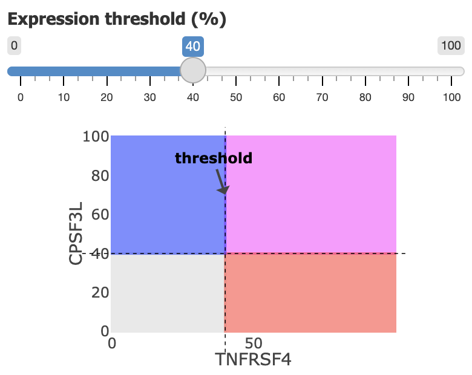

### Spatial Coexpression Plot
------------------------------

Compare marker gene expression on an interactive spatial plot using four colors to visualize co-expression patterns.

#### How It Works

The expression of each gene is scaled and grouped into percentile bins. The `Expression threshold (%)` defines when a cell is considered to be expressing a gene, creating four categories:

- **Neither (grey)**: Bottom left quadrant, both genes have low expression
- **Gene A only (red)**: Bottom right quadrant, gene A ↑, gene B ↓
- **Gene B only (blue)**: Top left quadrant, gene B ↑, gene A ↓
- **Both genes (purple)**: Top right quadrant, gene A ↑, gene B ↑

#### Threshold Effects

- **Lower threshold**: More cells considered to be expressing genes
  - `Neither` category gets smaller, all other categories get larger
- **Higher threshold**: Fewer cells considered to be expressing genes
  - `Neither` category gets larger, all other categories get smaller

#### Features

- **Summary table**: Shows count and proportion of cells in each category
- **Interactive legend**: Click to toggle visibility of specific categories
- **Gene selection**: Choose gene A & gene B from the dropdown menu
- **Scratchpad integration**: Marker genes in the `Gene scratchpad` appear at top of dropdown
- **Multiple slices**: If multiple tissue sections are present, they can be visualized separately

#### Controls

- **Marker size**: Adjust the size of points in the plot
- **Marker opacity**: Control transparency of points
- **Color map**: Select color scheme for expression visualization
- **Expression threshold**: Set percentile cutoff for gene expression
- **Downsample**: Option to reduce number of cells shown for improved performance
- **Slice selection**: Choose which tissue section(s) to display

#### Export Options

- Click the `Download` button to save the current plot to PDF
- Edit plot dimensions and image resolution in the popup dialog
