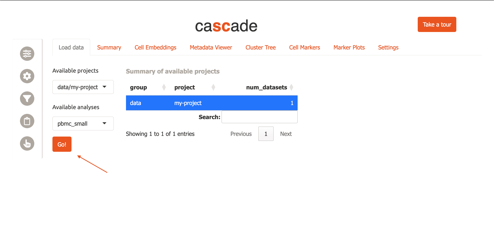
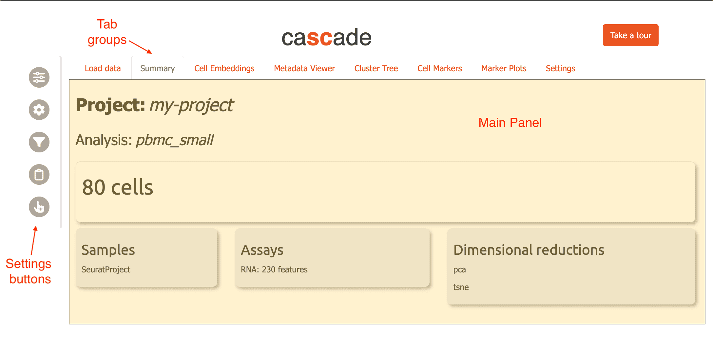
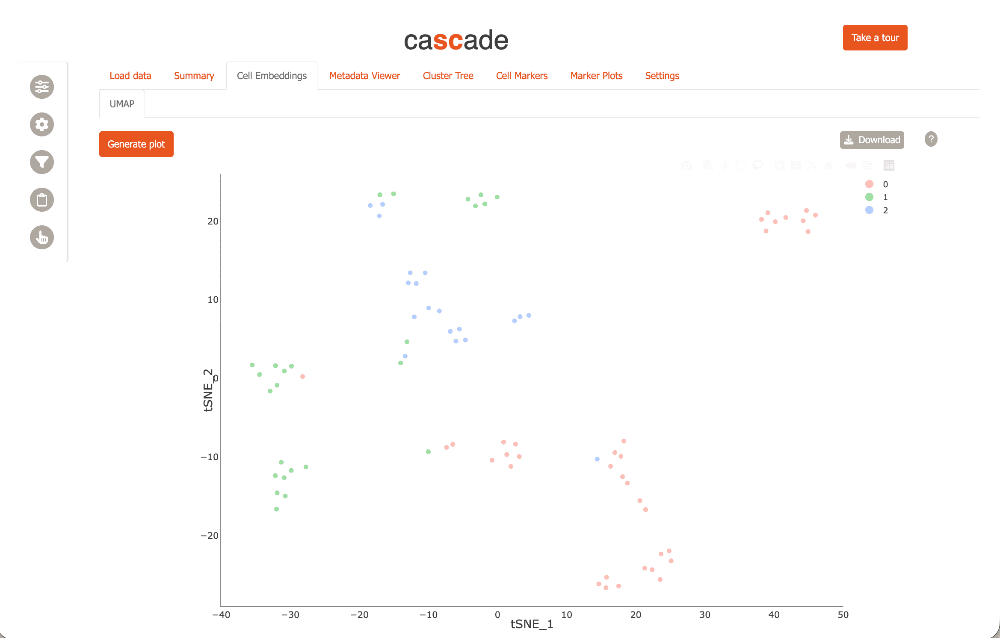
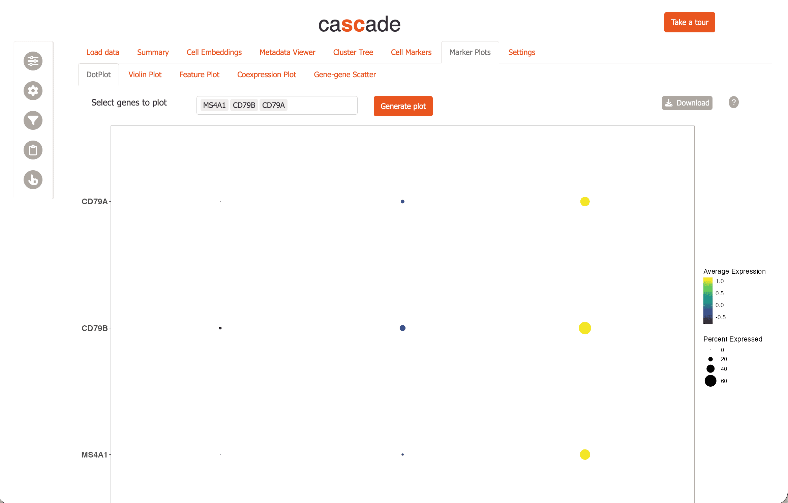
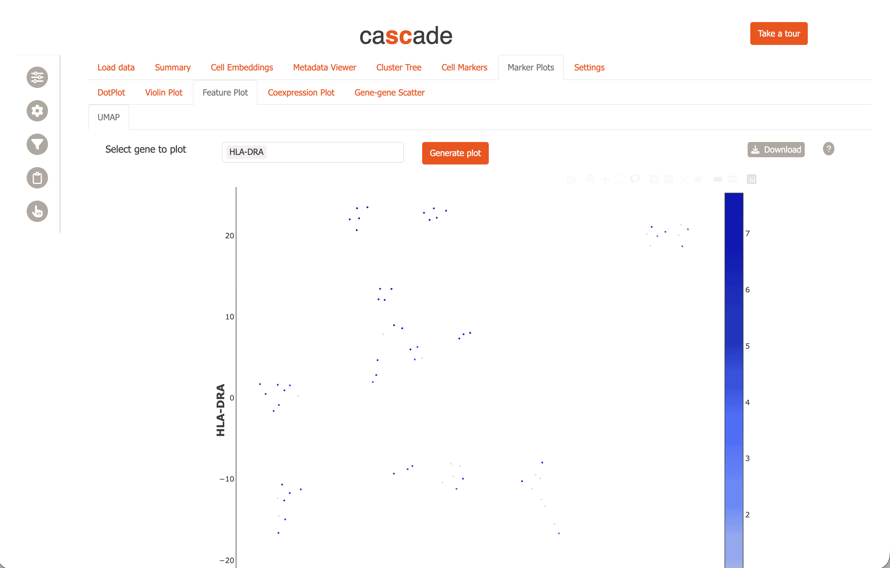
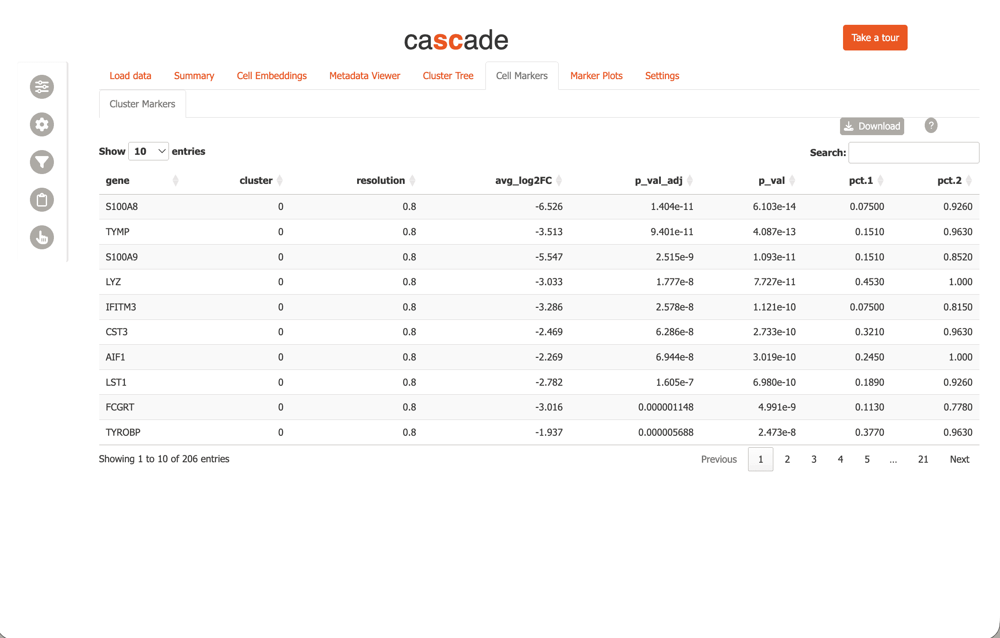

```{r opts, include = FALSE}
knitr::opts_chunk$set(
  collapse = TRUE,
  comment = "#>"
)
```

## Install cascadeR

Install cascadeR from Bioconductor using `BiocManager::install`.

```{r pkg_install, eval=FALSE}
# first check to see if BiocManager is available
if(!requireNamespace('BiocManager', quietly=TRUE)){
  install.packages('BiocManager')
}

BiocManager::install('cascadeR')
```

## Get example data

Now we load a small dataset with 80 cells and 230 features. It contains
two dimension reductions: *pca* and *tsne*.

```{r load}
library(Seurat)

data("pbmc_small", package="SeuratObject")

pbmc_small
```

## Inspect the metadata

Next, let's take a look at the metadata of this object.

```{r metadata}
head(pbmc_small)
```

There are two columns with standard quality control metrics:

- *nCount_RNA*
- *nFeature_RNA*

In addition, there are two columns with cell clusters calculated
at two resolutions. Higher resolutions correspond to more/smaller
cell clusters.

- *RNA_snn_res.0.8*: resolution = 0.8, 2 clusters
- *RNA_snn_res.1*: resolution = 1, 3 clusters

We visualize the resolution = `1.0` clustering using `Seurat::DimPlot`:

```{r dimplot}
Seurat::DimPlot(pbmc_small, group.by='RNA_snn_res.1')
```

## Marker detection

Next, we calculate gene markers to characterize individual
clusters for one of the resolutions using the `Seurat::FindAllMarkers`
function. Setting `Idents()` here to `RNA_snn_res.0.8` sets the
cell groups to clusters at resolution = `0.8`.

```{r markers}
Idents(pbmc_small) <- pbmc_small$RNA_snn_res.0.8
df <- FindAllMarkers(pbmc_small)
```

Now we have marker genes for each of the clusters at this resolution.

```{r head_markers}
head(df)
```

We often like to compare different resolutions, so let's do the
same for resolution = `1.0`.

```{r markers2, warning=FALSE}
Idents(pbmc_small) <- pbmc_small$RNA_snn_res.1
df2 <- FindAllMarkers(pbmc_small)
```

You can combine multiple such marker gene tables for use with `cascadeR`
to compare, e.g. different resolutions, "assays" or arbitrary "groups".
To do this, we concatenate our two marker gene sets and add a
"resolution" column.

```{r join_df}
df$resolution <- '0.8'
df2$resolution <- '1.0'

marker_df <- rbind(df, df2)
```


## Save results

Next, we save our results.

```{r save}
saveRDS(pbmc_small, 'seurat_pbmc_small.Rds', compress=FALSE)
write.table(marker_df, 'allmarkers_combined.tsv', sep='\t', row.names=FALSE, quote=FALSE)
```

## Data Organization

Next, we need to organize your data in a directory structure that `cascadeR`
can easily navigate, e.g. in a folder `cascader/data` in your home directory.
The folder should look something like this:

```
~/cascader/data/
  └─ my-project
     └─ pbmc_small
        ├─ clustered.Rds
        └─ allmarkers.tsv
```

Two things to note here:

- *Projects* are subfolders in the data area, while *analyses* are
  subfolders within projects. For instance, in the above example,
  `my-project` is the project name and `pbmc_small` is the analysis name.
  This 2-level hierarchy allows us to have multiple analyses using, e.g
  different analysis parameters, within a single project.

- `cascadeR` uses file extensions, e.g. `.Rds` or `.h5ad`, to figure
  out what data to read. You can have two kinds of files in an *analysis*
  folder:

  - Pre-processed single-cell/spatial object

    - `.Rds` (Seurat or SingleCellExperiment)
    - `.h5ad` (anndata)

  - Marker tables: `.tsv` or `.csv`

    - Marker genes for a cluster (compared to everything else).

      - Output from Seurat's `FindMarkers` or `FindAllMarkers` or scanpy's
        `sc.tl.rank_genes_groups` are supported.
      - Filenames must contain the string *allmarkers*.

    - Conserved marker genes across samples.

      - Output from Seurat's `FindConservedMarkers`.
      - Filenames must contain the string *consmarkers*.

    - Differential expression analysis, from comparing
      cell clusters or from pseudo-bulk analysis.

      - Output from Seurat's `FindMarkers` or pseudo-bulk analysis from `DESeq2`
        are supported.
      - Filenames must contain the string *demarkers*.

    - Marker gene tables supports special columns,
      "resolution", "assay", "group" to combine multiple sets of results
      for joint viewing.
    - If multiple marker gene tables of a particular type are found in the same
      *analysis* folder, they are concatenated together with the file name encoded
      in the "group" column.

We provide a helper function to set up a dataset while following the above
specifications. Let's use this now for the analysis we just performed.

First we create a data directory for `cascadeR`.

```{r create_dir, eval=FALSE}
dir.create('~/cascader/data', recursive=TRUE)
```

Next, we run `add_cascade_analysis` with the RDS file and marker table path
specified. By default, this function prints out the commands to be run -
to actually run them, we use `execute = TRUE`.

```{r add_analysis, eval=FALSE}
add_cascade_analysis(
  obj_path='seurat_pbmc_small.Rds',
  data_dir='~/cascader/data',
  project='my-project',
  analysis='pbmc_small',
  cluster_markers='allmarkers_combined.tsv',
  execute=TRUE
)
```

## First Run

Load the `cascadeR` package.

```{r first_load, eval=FALSE}
library(cascadeR)
```

CascadeR allows you to download interactive plots as PDF. To use
this functionality you need to install some required Python dependencies:

```{r install, eval=FALSE}
install_cascade()  # Installs plotly and kaleido for PDF export
```

Now, run the app:

```{r run_app, eval=FALSE}
run_cascade()
```

To run on a fixed port, e.g. when using remote servers with SSH port forwarding,
specify `port` within a list of options.

```{r run_app2, eval=FALSE}
run_cascade(options=list(port=12345, launch.browser=FALSE))
```

Then access cascadeR by opening the URL: `http://127.0.0.1:12345`


## Initial setup

The first time you run cascadeR, you will be asked to specify where your data
is located with a modal dialog. Enter the folder where you saved the RDS file,
`~/cascader/data`, then click 'OK'.

{width=600px}

Now cascadeR will automatically refresh and you will see `data/my-project` in
the "Available Projects" menu, and `pbmc_small` in the "Available Datasets".
You can click on the table directly or choose from the dropdown menu to select
the dataset. Now click 'Go' to load the data.

{width=600px}

Now carnation will load the pbmc data and switch to the "Summary" tab.

## General layout

The interface of CascadeR consists of a main central panel for content, a sidebar
containing settings and 'Gene scratchpad' buttons.

{width=700px}


## Feature overview

Now you can explore the dataset further using cell embeddings, e.g. tSNE.

{width=600px}

Visualize marker gene expression using dotplots,

{width=600px}

and feature plots

{width=600px}

and investigate gene candidates using "Cell Markers" module.

{width=600px}

CascadeR provides many more features to allow extensive exploration
of single-cell datasets.

- UMAP/spatial cell-embeddings or marker plots support lasso selection
  to select cells of interest. These selections can be used to create
  custom filters for the data or downloaded for further analysis.
- Marker tables can be directly clicked to select genes which can then be
  added to the gene scratchpad and tracked across the whole app.
- Custom filters can be created for cells based on metadata, gene expression or cell selection
  and save throughout a session.
- All plots can be saved to PDF and marker tables downloaded to TSVs.

For multi-user environments, CascadeR also supports authentication:

```r
# Create user database
credentials <- data.frame(
  user = c('shinymanager'),
  password = c('12345'),
  admin = c(TRUE),
  stringsAsFactors = FALSE
)

# Initialize the database
shinymanager::create_db(
  credentials_data = credentials,
  sqlite_path = 'credentials.sqlite',
  passphrase = 'admin_passphrase'
)

# Run with authentication
run_cascade(credentials='credentials.sqlite', passphrase='admin_passphrase')
```

# sessionInfo

```{r sessionInfo}
sessionInfo()
```
